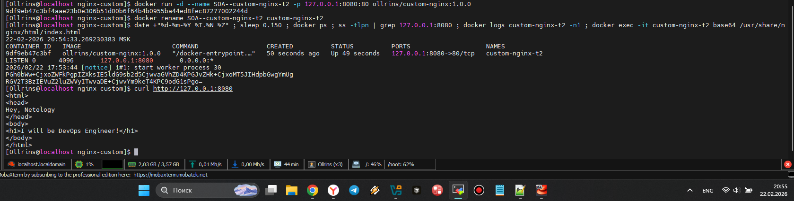
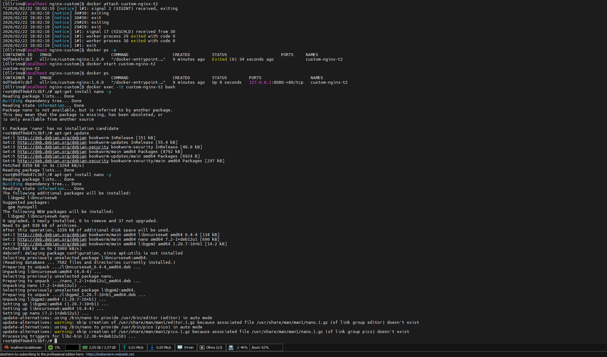
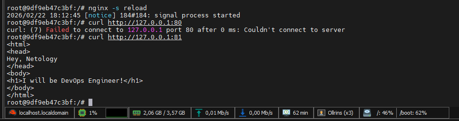
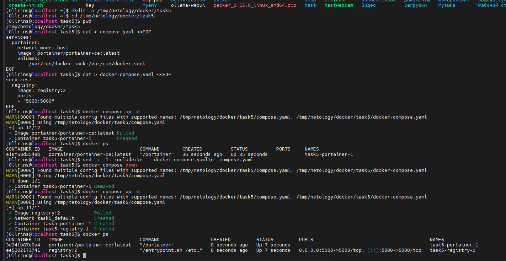
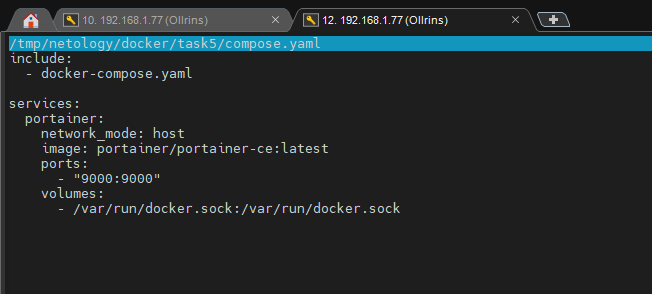
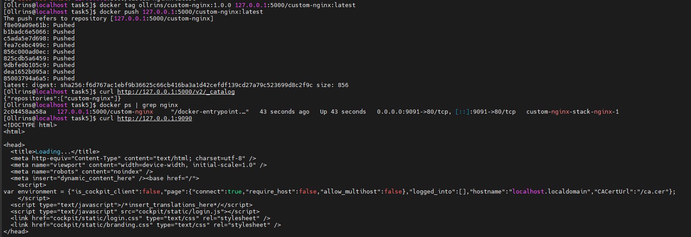
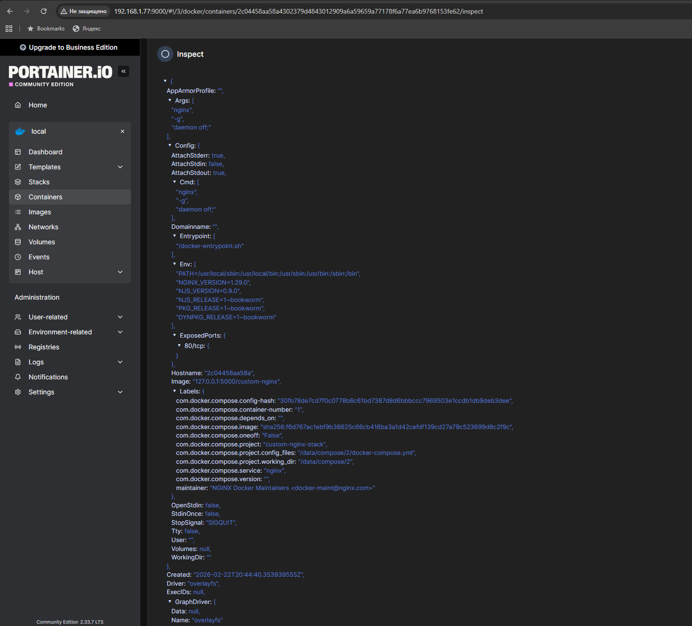
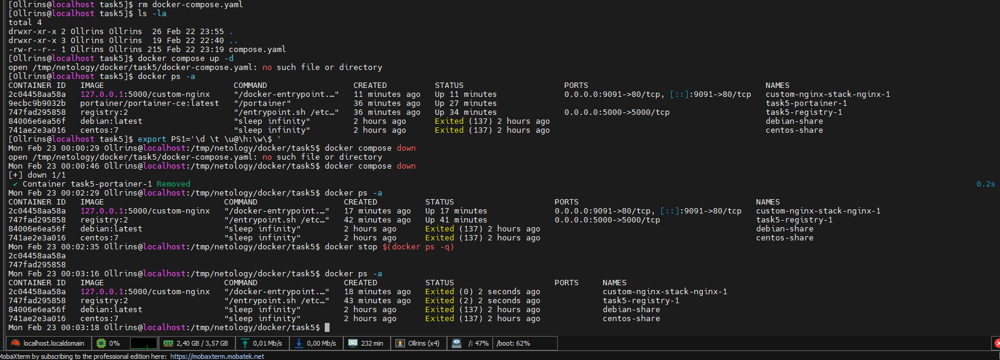

# Домашнее задание по Docker

## Задание 1: hub.docker.com 

   
  <em>https://hub.docker.com/r/ollrins/custom-nginx</em>

## Задание 2: Запуск custom-nginx

  
   
  <em>Рисунок 1 - Запуск контейнера, переименование и проверка. Доступность страницы через curl</em>

## Задание 3: Изменение конфигурации nginx

  
   
  <em>Рисунок 3 - Подключение к контейнеру и остановка через Ctrl+C</em>

  
   
  <em>Рисунок 5 - Изменение порта с 80 на 81 через nano</em>

  
   
  <em>Рисунок 6 - Проверка curl внутри контейнера (80 не работает, 81 работает). Проверка с хостовой машины (не работает)</em>

  
   
  <em>Рисунок 7 - Дополнительное задание</em>

## Задание 4: Общая папка между контейнерами

  
   
  <em>Рисунок 9 - Создание рабочей директории. Запуск контейнера CentOS с volume. Запуск контейнера Debian с volume. Создание файла из контейнера CentOS. Создание файла на хостовой машине. Проверка файлов из контейнера Debian </em>

   
  <em>Будет пояснение</em>

## Задание 5: Portainer и локальный registry

  
   
  <em>Рисунок 15 - Создание compose.yaml и docker-compose.yaml. Запуск docker compose up -d (только portainer). Добавление include в compose.yaml. Оба контейнера (portainer и registry) запущены </em>

  
   
  <em>Рисунок 21 - compose.yaml</em>

  
   
   
  <em>Рисунок 19 - Загрузка образа в локальный registry</em>

  
   
  <em>Рисунок 22 - Просмотр Config контейнера (AppArmorProfile до Driver)</em>

  
   
  <em>Рисунок 23 - Предупреждение об отсутствующем файле. Остановка проекта одной командой docker compose down</em>

